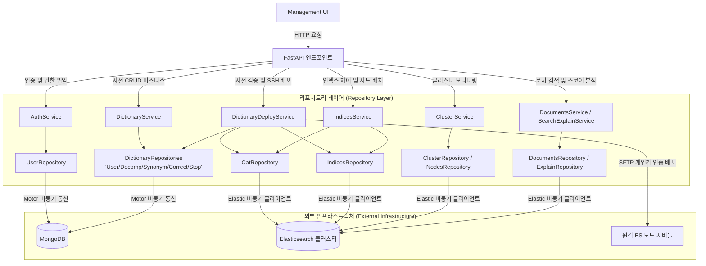

# 엘라스틱서치 관리 도구 API (management_api)

본 서비스는 **FastAPI**, **MongoDB** (시스템 메타데이터 및 사전 스테이징용), **Elasticsearch** (대상 검색 클러스터), **Paramiko** (보안 키 기반 SSH/SFTP 배포용)를 기반으로 구축된 **엘라스틱서치 관리 도구 백엔드 API** 서비스입니다.

본 API는 고도의 유지보수성과 레이어 간의 명확한 경계, 그리고 견고한 단위 테스트 환경을 위한 완벽한 모킹(Mocking)을 보장하기 위해 철저히 **서비스-리포지토리 아키텍처 패턴(Service-Repository Architecture Pattern)**을 준수하여 설계되었습니다.

---

## 🏗️ 시스템 아키텍처 (System Architecture)

애플리케이션은 역할에 따라 명확히 구분된 레이어로 구성되어 있습니다:
*   **엔드포인트 (FastAPI Endpoints)**: HTTP 요청을 수신하고, 역할 기반 보안 필터(RBAC)를 적용하며, 비즈니스 워크플로우를 서비스 레이어로 위임합니다.
*   **서비스 (Business Logic)**: 데이터 흐름을 조율하고, 사전 데이터 유효성 검증을 수행하며, 텍스트 파일을 가공하고, SSH/SFTP 노드와의 통신을 관리합니다. 데이터베이스나 엘라스틱서치 클라이언트를 직접 호출하지 않습니다.
*   **리포지토리 (Data Access)**: 외부 데이터베이스(Motor를 통한 MongoDB) 및 검색 엔진(AsyncElasticsearch)에 대한 조회 및 변경 작업을 전적으로 캡슐화합니다.



---

## 🔑 환경 변수 설정 (Environment Variables)

API 구동을 위해 반드시 구성해야 하는 환경 변수 목록입니다. 해당 변수들은 `src/resources/.env` 파일에 정의되어 관리됩니다.

| 분류 | 변수명 (Key) | 기본값 | 설명 |
| :--- | :--- | :--- | :--- |
| **애플리케이션** | `APPLICATION_ACTIVE_PROFILE` | `dev` | 활성화할 프로필 형태 (`dev`, `stg`, `prod`) |
| | `APPLICATION_PORT` | `18080` | API 서버가 대기할 포트 번호 |
| **MongoDB** | `MONGO_URI` | `mongodb://...` | 메타데이터 저장용 MongoDB 연결 URI |
| | `MONGO_DB_NAME` | `elasticsearch_management` | 사전 스테이징 데이터를 저장할 데이터베이스명 |
| **Elasticsearch**| `ES_HOST` | `https://...` | 엘라스틱서치 클러스터 노드 목록 (쉼표 구분 형태) |
| | `ES_API_KEY` | `your-api-key` | 클러스터 제어를 위한 전용 API 키 |
| | `ES_CERTS` | `path/to/cert.crt` | HTTPS 보안 검증용 SSL 인증서 경로 |
| **JWT 인증** | `JWT_SECRET_KEY` | _(변경 필요)_ | JWT 토큰 서명 시크릿 키. **운영계 배포 시 반드시 충분히 복잡한 무작위 문자열로 교체해야 합니다.** |
| | `JWT_ALGORITHM` | `HS256` | JWT 서명 알고리즘 |
| | `JWT_ACCESS_TOKEN_EXPIRE_HOURS` | `24` | 액세스 토큰 유효 시간 (단위: 시간). UI의 `NEXT_PUBLIC_AUTH_TOKEN_EXPIRE_HOURS`와 반드시 동일하게 맞춰야 합니다. |
| **SSH/SFTP** | `SSH_DICTIONARY_DIR`| `/etc/elasticsearch/analysis` | 사전 파일(`.txt`)들이 유지 관리되는 원격 디렉토리 경로 |
| | `SSH_SERVERS` | `'[{"host": "...", "username": "...", "key_path": "..."}]'` | **[필수]** 각 배포 대상 서버의 접속 정보 및 개별 SSH 인증 자격 정보가 기술된 JSON 배열 문자열 |

> [!CAUTION]
> **운영계(prod) 배포 시 `JWT_SECRET_KEY` 보안 필수 조치:**
> 기본값 `super-secret-key-for-admin-panel`은 개발용 플레이스홀더입니다. 운영 배포 시에는 반드시 아래와 같이 충분히 복잡한 무작위 시크릿으로 교체하십시오:
> ```bash
> # 안전한 랜덤 시크릿 키 생성 예시
> python3 -c "import secrets; print(secrets.token_hex(32))"
> ```

> [!TIP]
> **`SSH_SERVERS` JSON 상세 스키마:**
> 대상 서버 노드마다 서로 다른 보안 키나 패스워드 인증 수단을 사용할 수 있도록 설계되었습니다. JSON 배열 내 각 객체는 다음 필드를 가집니다:
> - `host` (또는 `ip`): **[필수]** 원격 노드 IP 주소 혹은 도메인
> - `port`: SSH 포트 번호 (생략 시 기본값 `22`로 동작)
> - `username`: **[필수]** SSH 접속 사용자 계정명
> - `password`: SSH 비밀번호 인증용 패스워드 (비밀번호 인증 시 사용)
> - `key_path`: SSH 개인키 파일 경로 (키 기반 인증 시 사용, 예: `/Users/username/.ssh/id_rsa`)
>
> **설정 예시 (`.env` 파일 설정 시):**
> ```ini
> SSH_SERVERS='[{"host": "127.0.0.1", "port": 22, "username": "centos", "key_path": "/Users/username/.ssh/id_rsa"}, {"host": "127.0.0.2", "port": 22, "username": "centos", "password": "secure_password"}]'
> ```

---

## 📡 API 레퍼런스 (API Reference)

모든 API 경로는 기본적으로 `/app` 프리픽스를 가집니다.

### 1. 사용자 인증 및 접근 권한 관리 (`/app/auth`)
| HTTP 메서드 | 엔드포인트 | 필요한 권한 | 설명 |
| :--- | :--- | :--- | :--- |
| `POST` | `/login` | `Guest` | 사용자 계정/비밀번호 인증 및 JWT 액세스 토큰 반환 |
| `GET` | `/me` | `WRITER` / `ADMIN` | 로그인한 사용자 프로필 상세 정보 조회 |
| `PUT` | `/me` | `WRITER` / `ADMIN` | 로그인한 사용자의 개인 프로필 정보 수정 |
| `GET` | `/users` | `ADMIN` | 시스템에 등록된 모든 포털 사용자 목록 조회 |
| `POST` | `/users` | `ADMIN` | 신규 포털 사용자 계정 등록 및 권한(`WRITER`, `ADMIN`) 부여 |
| `PUT` | `/users/{id}` | `ADMIN` | 특정 사용자의 상세 정보 및 시스템 권한 수정 |
| `DELETE`| `/users/{id}` | `ADMIN` | 특정 사용자 계정 삭제 |

### 2. 사전 관리 API (`/app/dictionaries`)
한국어 검색 사전을 구성하는 5대 사전(사용자 정의 명사, 복합어 분해 사분, 동의어, 오타 교정, 불용어)을 통합 제어합니다.

| HTTP 메서드 | 엔드포인트 | 필요한 권한 | 설명 |
| :--- | :--- | :--- | :--- |
| `GET` | `/user/search` | `WRITER` / `ADMIN` | 스테이징 영역의 사용자 명사 사전 검색 |
| `POST` | `/user/create` | `WRITER` / `ADMIN` | 신규 스테이징 명사 등록 |
| `PUT` | `/user/update/{w}`| `WRITER` / `ADMIN` | 기존 스테이징 명사 정보 수정 |
| `DELETE`| `/user/delete/{w}`| `WRITER` / `ADMIN` | 스테이징 명사 소프트 삭제 (Soft-delete) |
| `GET` | `/decompound/search`| `WRITER` / `ADMIN` | 복합어 및 분해 명사 리스트 검색 |
| `POST` | `/decompound/create`| `WRITER` / `ADMIN` | 신규 복합어 스테이징 정보 등록 |
| `PUT` | `/decompound/update`| `WRITER` / `ADMIN` | 기존 복합어 스테이징 정보 수정 |
| `DELETE`| `/decompound/delete`| `WRITER` / `ADMIN` | 복합어 스테이징 정보 소프트 삭제 |
| `GET` | `/synonym/search` | `WRITER` / `ADMIN` | 동의어 사전 매핑 그룹 검색 |
| `POST` | `/synonym/create` | `WRITER` / `ADMIN` | 신규 동의어 스테이징 그룹 등록 |
| `PUT` | `/synonym/update` | `WRITER` / `ADMIN` | 기존 동의어 스테이징 그룹 수정 |
| `DELETE`| `/synonym/delete` | `WRITER` / `ADMIN` | 동의어 스테이징 그룹 소프트 삭제 |
| `GET` | `/correction/search`| `WRITER` / `ADMIN` | 오타 교정 매핑 리스트 검색 |
| `POST` | `/correction/create`| `WRITER` / `ADMIN` | 신규 오타 교정 스테이징 맵 등록 |
| `PUT` | `/correction/update`| `WRITER` / `ADMIN` | 기존 오타 교정 스테이징 맵 수정 |
| `DELETE`| `/correction/delete`| `WRITER` / `ADMIN` | 오타 교정 스테이징 맵 소프트 삭제 |
| `GET` | `/stopword/search` | `WRITER` / `ADMIN` | 커스텀 불용어 단어 검색 |
| `POST` | `/stopword/create` | `WRITER` / `ADMIN` | 신규 불용어 스테이징 단어 등록 |
| `PUT` | `/stopword/update` | `WRITER` / `ADMIN` | 기존 불용어 스테이징 단어 수정 |
| `DELETE`| `/stopword/delete` | `WRITER` / `ADMIN` | 불용어 스테이징 단어 소프트 삭제 |
| `POST` | `/validate` | `ADMIN` | **APPROVED 상태 사전 데이터의 SSH 정밀 검증 기동 (동기/블로킹)** |
| `GET` | `/validate/stream` | `ADMIN` | **사전 검증 실시간 스트리밍 (Server-Sent Events) - 쿼리 토큰 (?token=) 지원** |
| `POST` | `/publish` | `ADMIN` | **원격 백업, 실서버 SFTP 파일 적용 및 APPLIED 상태 동기화 (동기/블로킹)** |
| `GET` | `/publish/stream` | `ADMIN` | **사전 배포 실시간 스트리밍 (Server-Sent Events) - 쿼리 토큰 (?token=) 지원** |

### 3. 클러스터 및 인덱스 모니터링 API (`/app/cluster`, `/app/indices`, `/app/documents`)
| HTTP 메서드 | 엔드포인트 | 필요한 권한 | 설명 |
| :--- | :--- | :--- | :--- |
| `GET` | `/cluster/node-status` | `WRITER` / `ADMIN` | 활성 노드 목록 및 장비 연결 상태 정보 조회 |
| `GET` | `/cluster/cluster-status` | `WRITER` / `ADMIN`| 클러스터 마스터 메트릭 및 헬스 체크 색상 반환 |
| `GET` | `/indices/indices-placement`| `WRITER` / `ADMIN`| 물리 노드별 샤드 배치(Allocation) 상태 리스트 조회 |
| `GET` | `/indices/indices` | `WRITER` / `ADMIN` | 전체 검색 인덱스 목록 조회 |
| `GET` | `/indices/indices/{name}`| `WRITER` / `ADMIN` | 특정 인덱스의 설정(Settings), 매핑(Mappings) 및 크기 조회 |
| `POST`| `/indices/indices/{name}/actions`| `ADMIN` | 특정 인덱스의 동작(Reindex, Refresh, Open, Close) 제어 |
| `GET` | `/documents/indices` | `WRITER` / `ADMIN` | 검색 가능한 활성 인덱스 리스트 조회 |
| `POST`| `/documents/search` | `WRITER` / `ADMIN` | 하이라이터 기능을 지원하는 검색 결과 쿼리 수행 |

---

## 🔄 사전 데이터 수명 주기 관리 (Dictionary Lifecycle)

관리자가 수정/가공하는 커스텀 사전 스테이징 요소들은 MongoDB에 정밀 저장된 후, 실제 검색 클러스터 성능에 반영되기 전에 다음과 같은 엄격한 상태 변화를 거칩니다:

```
[신규 등록 또는 소프트 삭제 항목 복원] ──> 상태: DRAFT (초기 임시 저장, 수정 가능)
                                                │
                                                ▼ (사용자가 '승인' 처리)
                                        상태: APPROVED (원격 배포 준비 및 대기 단계)
                                                │
                                                ▼
                                    기능: /validate (대상 클러스터 사전 파일 정밀 검증)
                                                │
                                                ▼
                                    기능: /publish  (보안 SFTP 전송 및 원격지 영구 보관)
                                                │
                                                ▼
                                        상태: APPLIED (원격지 실제 반영 및 클러스터 활성화)
```

> [!NOTE]
> **소프트 삭제(Soft-delete) 및 복원 로직:**
> 사전 항목 삭제 시 실제 데이터는 제거되지 않고 `delete_yn = "Y"` 플래그로 논리 삭제됩니다. 이후 동일한 키(단어)로 재등록 시도 시 서비스 레이어에서 아래 분기 처리가 자동으로 수행됩니다:
> - **활성 상태(`delete_yn = "N"`)** 항목이 이미 존재 → `BizException(400, "이미 등록되어 있는 항목입니다.")` 반환
> - **소프트 삭제(`delete_yn = "Y"`)** 항목이 존재 → 해당 항목을 복원(`delete_yn = "N"`, `status = DRAFT`)하고 새 등록 대신 업데이트 처리

1.  **사전 초기 등록 단계 (DRAFT)**:
    *   사전 편집자(`WRITER` 또는 `ADMIN`)가 포털에서 사전 항목을 신규 등록하거나, 소프트 삭제된 항목이 복원될 때 MongoDB에 상태 `DRAFT`로 기록됩니다.
    *   `DRAFT` 상태는 아직 승인되지 않은 초안 단계를 의미하며, 수정 및 삭제가 자유롭습니다.
    *   삭제(`delete`) 처리 시에도 상태가 `DRAFT`로 초기화되며 승인 정보가 초기화됩니다.
2.  **사전 배포 대기 단계 (APPROVED)**:
    *   `DRAFT` 항목이 사용자에 의해 승인 처리되면 상태가 `APPROVED`로 변경됩니다.
    *   `APPROVED` 상태는 사용자가 수정을 완료하여 승인했으나 아직 원격 검색 엔진 실서버에는 전송/업로드되지 않은 대기 상태를 나타냅니다.
    *   `/validate` 및 `/publish` 파이프라인의 처리 대상은 `APPROVED` + `APPLIED` 상태의 항목 전체를 합산하여 생성됩니다.
3.  **검색엔진 배포 완료 단계 (APPLIED)**:
    *   관리자에 의해 배포 프로세스가 정상적으로 최종 완수되면, MongoDB의 사전 데이터 상태가 일괄적으로 `APPLIED`로 전환되며, 배포 완료 이력 UTC/KST 타임스탬프가 함께 기록됩니다.

---

## 🚀 사전 유효성 검증 및 배포 파이프라인 (Deployment Pipeline)

배포 프로세스는 검색 클러스터의 중단 없는 안정성을 기하기 위해 견고한 **다단계 실패 방지(Fail-safe) 로직**을 거쳐 동작합니다:

### 1. 사전 유효성 검증 단계 (`POST /validate`)
실제 검색 엔진 시스템의 설정 변경이나 파일 오버라이팅을 진행하기에 앞서 가상의 자원으로 완벽한 모의 검증을 수행합니다:
1.  **Deduplicated Parsing (데이터 무결성 가공)**: MongoDB 데이터베이스 내의 `APPROVED` 및 `APPLIED` 상태인 사전 목록을 전부 읽어와 중복을 제거하고 가나다순으로 정렬한 뒤, 형태소 분석용 텍스트 표준 구조로 결합합니다:
    *   *사용자 정의 명사*: 1행당 1개의 단어
    *   *복합어 분해*: `단어,분해단어1,분해단어2`
    *   *동의어*: `동의어1,동의어2`
    *   *오타 교정*: `오류어 => 교정어`
    *   *불용어*: 1행당 1개의 단어
2.  **Remote Connection & Test Upload (원격 검증 전송)**: `SSH_SERVERS` 설정에 명시된 모든 원격 검색 노드 서버들에 각각 구성된 SSH 인증 정보(SSH 개인키 기반 혹은 ID/PW 비밀번호 기반)를 동적으로 파악하여 SFTP 접속합니다. 이후 테스트 파일인 `noun_test.txt`, `synonym_test.txt`, `stop_test.txt`를 원격 폴더로 업로드합니다.
3.  **Index Template Simulation (인덱스 템플릿 검증)**: 엘라스틱서치 내에 모의 인덱스 템플릿인 `dictionary_test_template`을 생성하고, 업로드한 임시 텍스트 파일들을 사용하도록 노리 형태소 분석기(nori_tokenizer 및 synonym/stop filter) 설정을 정밀 바인딩합니다.
4.  **Test Index Execution (임시 인덱스 기동)**: 사전 존재하던 모의 인덱스를 안전하게 완전히 삭제하고, 검증 대상 사전 파일 설정이 녹아 있는 신규 모의 인덱스 `dictionary_test`를 생성합니다.
5.  **Text Analysis Test (분석 테스트 검증)**: 방금 업로드한 신규 단어들이 실제로 잘 분해 및 교정되는지 검증하기 위해 엘라스틱서치 `_analyze` API를 호출하여 모의 분석을 수행합니다. 형태소 분석 토큰이 정상적으로 리턴되면 유효성 검증은 **SUCCESS(성공)**로 선언됩니다.
6.  **Clean up (가상 자원 안전 정리)**: 모의 인덱스 `dictionary_test`를 안전하게 폭파하고 원격 노드 장비들에 올려두었던 3가지 임시 파일들(`*_test.txt`)을 깨끗이 원격 삭제합니다.

### 2. 원격 실서버 배포 단계 (`POST /publish`)
검증 단계가 완벽히 통과된 것이 입증되면 비로소 배포가 허가됩니다:
1.  **Pre-flight Verification (배포 전 재검증)**: 배포의 안전성을 위해 위에 기술된 유효성 검증 파이프라인(`validate_dictionaries`)을 최우선적으로 자동 선행 기동합니다.
2.  **SSH Server Backup (실서버 파일 백업)**: 원격 노드에 접속한 뒤, 기존 서비스에서 실제 작동 중이던 사문 파일(`noun.txt`, `synonym.txt`, `stop.txt`)들을 읽어와 타임스탬프 접미사가 포함된 백업 디렉토리(예: `backup/noun_20260518_1025.txt`)로 안전하게 물리 복사하여 장애 발생 시 즉시 롤백할 수 있도록 조치합니다.
3.  **Active Deployment (실제 사전 반영)**: 최종 합산 및 가공된 전체 명사, 동의어, 불용어 파일들(`noun.txt`, `synonym.txt`, `stop.txt`)을 원격 노드들의 정식 사전 경로에 업로드하여 반영합니다.
4.  **Database Synchronization (데이터베이스 동기화)**: 배포가 성공한 모든 대상 사전 메타데이터 문서들의 상태를 MongoDB 내에서 `APPROVED`에서 `APPLIED`로 최종 변환하고 실제 배포 완료 타임스탬프(`applied_at_kst`)를 마킹합니다.
5.  *(후속 단계: 이후 인덱스 설정 재로딩이나 인덱스 Close/Open 처리를 거침으로써 엘라스틱서치 분석 엔진 내부 메모리에 최신 사전 사전 데이터가 완전하게 상주하고 가동됩니다.)*

---

## 📡 실시간 사전 배포 진행률 스트리밍 (SSE Progress Streaming)

본 서비스는 사전 배포 및 유효성 검사 등 오랜 시간이 걸리는 복잡한 작업을 수행할 때, 프론트엔드 UI에 진행 상황을 단계별로 실시간 중계하기 위해 **Server-Sent Events(SSE)**를 지원합니다.

### 1. 연결 및 보안 아키텍처
*   **엔드포인트**:
    *   `/app/dictionaries/validate/stream?token=JWT_ACCESS_TOKEN`
    *   `/app/dictionaries/publish/stream?token=JWT_ACCESS_TOKEN`
*   **브라우저 EventSource 지원을 위한 보안 우회**:
    *   브라우저의 Native `EventSource` API는 기본적으로 헤더 커스터마이징(예: `Authorization: Bearer <token>`)을 허용하지 않습니다.
    *   따라서 본 API의 SSE 스트림 엔드포인트는 JWT 토큰을 쿼리 파라미터 `token`으로 받아들여 안전하게 디코딩하고, 계정 정보 및 `ADMIN` 역할을 철저히 검증하도록 설계되었습니다.

### 2. 스트리밍 데이터 명세
스트림 수신 시 각 단계마다 `data: ` 프리픽스를 가진 JSON 객체가 실시간으로 방출되며, 작업 완료 또는 실패 시 접속이 자동 종료됩니다:

```json
// 진행 중인 상태 예시
data: {"step": "SFTP_UPLOAD", "message": "모든 노드 서버에 검증용 테스트 파일 전송 완료", "status": "SUCCESS"}

// 에러 발생 상태 예시
data: {"step": "ERROR", "message": "샘플 단어 '테스트'의 분석에 실패했습니다.", "status": "FAILED"}
```

#### 주요 단계별 코드 (Steps)
1.  `PREPROCESS` (사전 원시 텍스트 로드 및 무결성 중복제거/가공)
2.  `SSH_CONNECT` (원격 SSH 접속 테스트)
3.  `SFTP_UPLOAD` (검증용 임시 테스트 파일 노드 전송)
4.  `ES_TEMPLATE` (검증용 임시 인덱스 템플릿 설정)
5.  `ES_INDEX` (검증 인덱스 생성 및 노리 분석기 기동)
6.  `ES_ANALYZE` (실제 사전 데이터 유효 형태소 모의 분석 테스트)
7.  `CLEANUP` (임시 테스트 파일 및 모의 인덱스 삭제 회수)
8.  `SSH_BACKUP` (배포 전 노드 내 운영 중인 파일 안전 백업 백업본 생성)
9.  `SFTP_DEPLOY` (정식 사전 파일 노드 반영 적용)
10. `DB_SYNC` (APPROVED -> APPLIED 데이터베이스 승인 동기화)
11. `COMPLETE` (전체 배포/검증 공정 최종 완수)